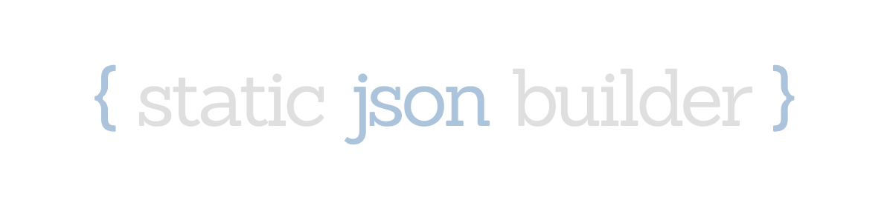

<p align="center">
    
</p>

<p align="center">
    
    
    
    
    
    
</p>

Library for convenient initialization of JSON objects without memory allocations.

# 👨‍💻 Usage

You can see examples sources [here](examples).

```c
#include <stdlib.h>
#include <stdio.h>
#include <static-json-builder.h>

int main(void)
{
    Json json = JsonObject(                /*  {                                 */
        JsonProp("items", JsonArray(       /*     "items": [                     */
            JsonNull(),                    /*         null,                      */
            JsonBool(true),                /*         true,                      */
            JsonInt(1),                    /*         1,                         */
            JsonString("hello")            /*         "hello",                   */
        ))                                 /*      ],                            */
    );                                     /*  },                                */

    char *string = json_stringify(json);   /*  {"items":[null,true,1,"hello"]}  */
    printf("%s\n", string);

    free(string);
    return 0;
}
```

# 🔨 Building, testing and installing

```bash
$ meson build -Dbuildtype=release -Dtests=true
$ cd build
$ meson test
$ meson compile
$ sudo meson install
```

# 🔌 Linking

The library supports pkg-config, which makes linking easier and more convenient.

>👍 [Single header](single-header/c-flags.h) version is also supported!

```cmake
cmake_minimum_required(VERSION 3.14)
project(program)

find_package(PkgConfig)
pkg_check_modules(StaticJsonBuilder REQUIRED IMPORTED_TARGET static-json-builder)

add_executable(program example.c)

target_link_libraries(program PUBLIC PkgConfig::StaticJsonBuilder)
```
